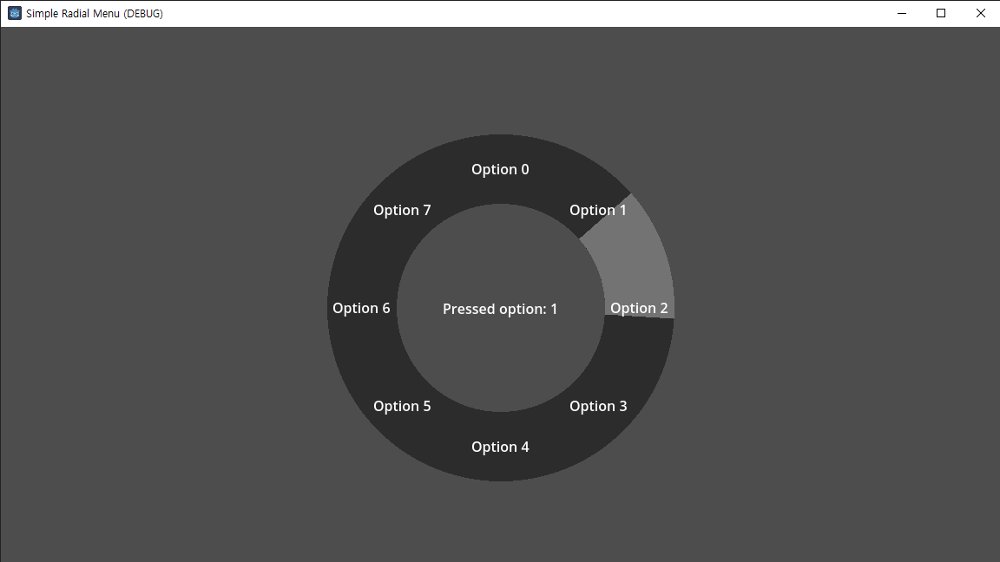

# SimpleRadialMenu
Simple radial menu UI for Godot 4

How to use:
1. Add a RadialMenu node or attack dw_radial_menu.gd to a Control node
2. Set its size
3. Set the number of options the radial menu should have
4. Add the icons as children of RadiaMenu node
5. Connect the pressed signal to an observer
6. Implement logic in observer to do stuff

